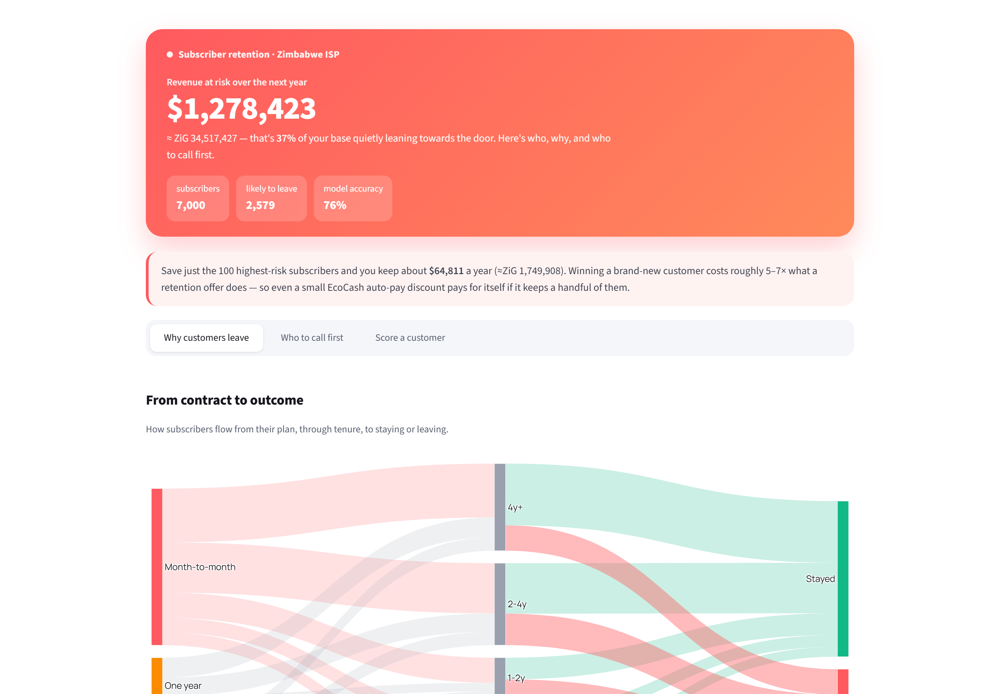

# Subscriber retention

A churn model for a Zimbabwean ISP — which subscribers are about to leave, why, and what a retention dollar would actually save.

<p>
  
  
  
  
  
</p>

<p align="center">
  
</p>

## What this is

A churn project built around the way Zimbabweans actually use a telco subscription: they pay via EcoCash, OneMoney, InnBucks, ZIPIT, bank debit order or cash at the branch; they're on Econet, NetOne or Telecel for mobile and ZOL, Liquid or TelOne for home internet; and they live with anywhere from one to twelve hours of load-shedding a day. None of that is in the IBM Telco dataset.

The model is an XGBoost classifier on a SMOTE-balanced training set. The dashboard turns the predictions into something a retention team can act on: who to phone first, why people on certain plans leave, and what the lift on a small EcoCash auto-pay discount would be.

## Results

| Metric | Value |
|---|---|
| ROC-AUC (test) | **0.89** |
| Recall | 0.76 |
| Precision | 0.74 |
| Top driver | Month-to-month + short tenure + cash deposit |

> The dataset is generated to match the structure of the Zim ISP market — schema, contract / bundle / payment / network mix, and load-shedding hours are calibrated to real conditions. Treat the absolute numbers as a synthetic demonstration, not a market study.

## The dashboard

Three plain-English screens:

- **Why customers leave** — sankey of contract → tenure → outcome, heatmap of churn by tenure and contract, and Zim-specific cuts (MNO, province, load-shedding hours, payment rail), each next to a one-line business take.
- **Who to call first** — the 50 highest-risk subscribers ranked by churn probability, with their monthly value in USD and ZiG.
- **Score a customer** — fill in a subscriber profile, get a probability with a comparison to the portfolio average and a suggested retention play.

## Run it yourself

```bash
pip install -r requirements.txt
jupyter notebook customer_churn_prediction.ipynb   # generates the synthetic dataset
streamlit run dashboard.py
```

## Project layout

```
zim-telco-churn/
├── README.md
├── requirements.txt
├── customer_churn_prediction.ipynb
├── dashboard.py
├── src/
│   └── generate_data.py   # Zim-calibrated synthetic data generator
├── data/
│   └── churn_data.csv     # generated on first run
└── docs/
    └── dashboard.png
```

## What I'd add next

- Tune the classification threshold against the real cost of a false positive vs a false negative (retention call cost vs replacement cost).
- LightGBM as a second base learner; compare training time and AUC.
- A small FastAPI wrapper so the model can be called from a CRM.

---

Built by **Tadaishe Maumbe** · [@nanettetada](https://github.com/nanettetada)
